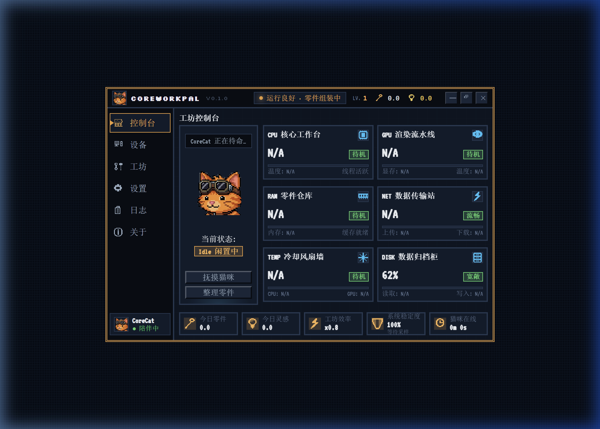
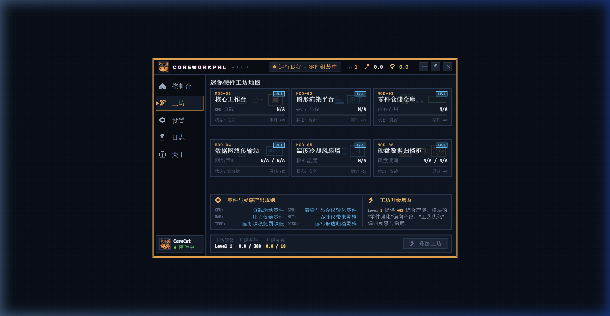
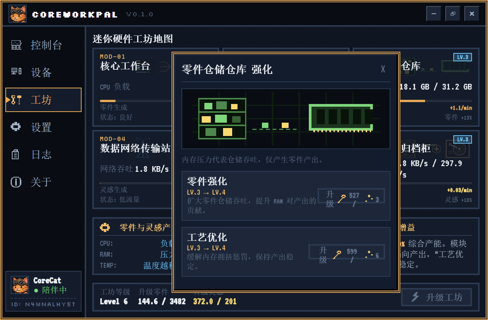
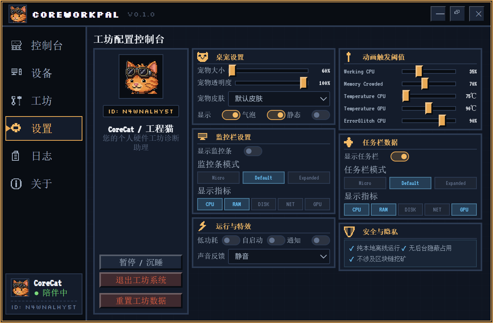
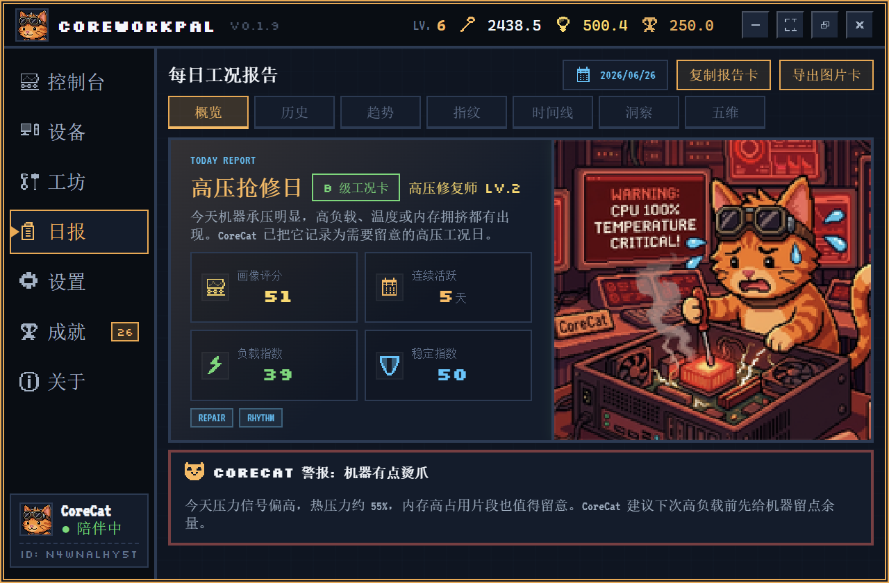
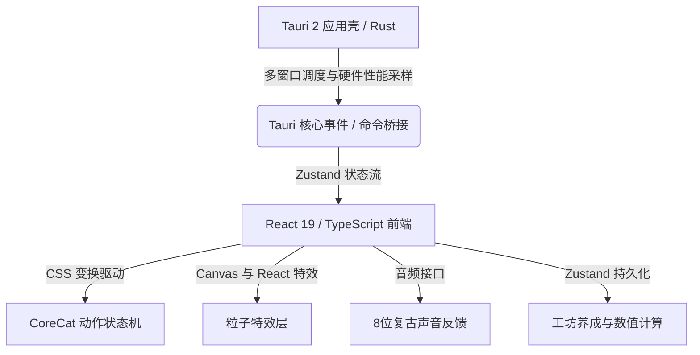

# CoreWorkPal ⚙️🐱

**CoreWorkPal** 是一款基于 **Tauri 2 + React 19 + TypeScript + Rust** 开发的轻量级桌面硬件诊断与趣味工坊养成伴侣。项目将核心硬件指标（处理器、显卡、内存、网络、温度、磁盘）与复古像素美术、桌面宠物动作状态机以及工坊升级体系进行趣味化融合，旨在为大家日常工作中提供一个精致、好玩且实用的桌面伴侣。

---

## 🌟 核心特性

### 1. 🐈 智能像素桌面宠物 CoreCat
* **动态行为映射**：桌面猫咪会根据系统真实的硬件负载指标自动切换动画。例如：
  * **处理器负载过高**：进入疯狂整理文件状态。
  * **内存告急**：进入汗流浃背状态。
  * **温度过高**：进入拿扇子拼命扇风降温状态。
  * **闲置与休息**：自动进入待命或沉睡休眠状态。
* **粒子特效层**：支持气泡碎屑、警告蒸汽、闪烁火花、星光庆祝等粒子特效，完美配合猫咪的升级与交互动作。
* **音效反馈系统**：集成机械开关、升级触发等 8位复古电子声音反馈。

### 2. 🛠️ 迷你诊断工坊
* **硬件数据变现**：硬件负载与活动将被转化为升级资源：
  * **处理器、显卡、内存** 占用率产生 **「零件」**。
  * **网络吞吐、磁盘读写** 活跃度产生 **「灵感」**。
* **工坊长线策略养成**：
  * 支持升级工坊主等级与 6 大硬件工作台子模块（强化硬件效能与稳定度）。
  * 具备成倍提升的非线性消耗曲线与 100 级强化硬上限。
  * 提供实时增益面板，清晰展示当前工坊等级带来的生产速度修正与硬件模块产出加成。

### 3. 📊 专业级系统监控与诊断
* **独立悬浮监控条**：支持微型、默认、展开三种布局，并可自定义显示处理器、内存、磁盘、网络、显卡等指标，支持自由拖动并记录位置。
* **任务栏状态监测**：与悬浮窗分离，支持直接嵌入任务栏辅助区或独立状态行。
* **稳定性与诊断看板**：主控制台提供直观的数据图表，动态显示各项硬件的历史占用率与诊断日志。

### 4. 🎨 复古像素视觉美学
* **全量矢量化**：工坊的 6 个工作台背景插图全部使用自研的高饱和度复古像素 SVG 矢量设计。
* **多色动态主题**：支持“暖心布丁橙”、“梦幻苏打蓝”、“甜心蜜桃粉”等主题皮肤切换，全局界面与图标点阵自动适配颜色深度。

---

## 📸 软件截图

以下是 CoreWorkPal 桌面伙伴的实际运行界面截图，采用精致的像素风双音色视觉设计：

### 🖥️ 主控制台与核心监控


### 🛠️ 硬件养成工坊与模块升级
| 迷你工坊主页 | 子模块升级详情 |
| :---: | :---: |
|  |  |

### ⚙️ 精细化配置控制台与日志审计
| 工坊配置控制台 | 日志审计面板 |
| :---: | :---: |
|  |  |

---

## 🛠️ 技术架构



### 1. 后端 (Rust / Tauri 2)
* **硬件性能采样**：采用低开销的多线程循环，以毫秒级精度采集处理器、系统内存、显卡占用、温度与磁盘网络读写速率，最大限度减少对宿主系统资源的损耗。
* **窗口编排与托盘控制**：实现主控制台、桌面宠物（支持透明鼠标穿透）、监控挂件等多个窗口的协同管理。
* **Windows 系统子配置**：应用 `windows_subsystem` 配置，在生产环境构建下自动隐藏后台命令行窗口。

### 2. 前端 (React / TypeScript / Zustand)
* **状态管理**：分别设立 `settingsStore`（偏好设置与阈值）、`workshopStore`（工坊数值）、`hardwareStore`（硬件指标数据）、`petStore`（宠物交互状态）和 `workLogStore`（系统日志）进行状态管理，保证多窗口数据在后台单向循环且实时同步。
* **像素点阵渲染**：核心组件与像素图标库全部在 SVG 内定义，配合 `image-rendering: pixelated` 样式在分辨率较高的屏幕下呈现粒粒分明的视觉质感。

---

## 📂 项目结构

```text
├── .docs/                    # 进度追踪与项目路线图
├── scripts/                  # 辅助工具脚本
│   ├── optimize-animation-pngs.mjs   # 图片无损压缩与还原校验脚本
│   └── run-corecat-animation-tests.mjs  # 状态机回归测试脚本
├── src-tauri/                # Tauri 2 后端 (Rust)
│   ├── src/
│   │   ├── monitoring/       # 硬件状态监测实现（处理器、显卡、内存、网络、磁盘、温度）
│   │   ├── tray/             # 托盘图标及右键菜单控制
│   │   ├── lib.rs            # 窗口配置与核心初始化
│   │   └── main.rs           # Tauri 程序入口
│   └── tauri.conf.json       # Tauri 窗口大小、透明度及编译权限定义
└── src/                      # 前端 (React 19 + TypeScript)
    ├── assets/               # 静态资源（像素风图标、动画帧序列）
    ├── pages/                # 主界面多页面组件（控制台、设备、工坊、设置、关于等）
    ├── pet/                  # 桌面宠物模块（状态机、骨骼节点及粒子特效）
    ├── services/             # 状态计算公式、Tauri 命令桥接逻辑
    ├── stores/               # 状态管理跨窗口全局状态集
    └── ui/                   # 全局基础界面、像素图标组件与图片导出配置
```

---

## 🚀 快速启动

本系统使用 `pnpm` 进行前端包管理。请在包含 Node.js、Rust/Cargo 开发环境的本地系统上运行：

### 1. 安装前端依赖
```bash
pnpm install
```

### 2. 运行开发服务
```bash
pnpm tauri dev
```

### 3. 执行类型检查
```bash
pnpm typecheck
```

### 4. 运行后端单元测试
```bash
cd src-tauri
cargo test
```

### 5. 压缩并校验宠物帧动画资源
```bash
pnpm optimize:animations
```

### 6. 构建前端静态资源包
```bash
pnpm build
```

### 7. 编译打包桌面端可执行文件 (.exe)
```bash
pnpm tauri build
```
编译完成后，生成的可执行文件与安装程序位于：
* **免安装绿色版 EXE**: `src-tauri/target/release/core-work-pal.exe`
* **NSIS 安装包**: `src-tauri/target/release/bundle/nsis/CoreWorkPal_0.1.0_x64-setup.exe`

---

## 🛡️ 安全与隐私保护

* **纯本地运行**：程序绝不上传任何用户的使用数据、进程列表或网络细节。
* **开源透明**：完整代码已托管于官方仓库，可供自由审计与编译：
  `https://github.com/FiveDayZ/CoreWorkPal.git`
* **无隐蔽占用**：不执行任何后台隐秘网络回传、不包含任何区块链挖矿及敏感资源占用行为。
