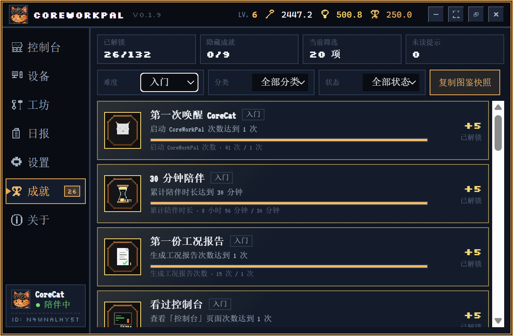
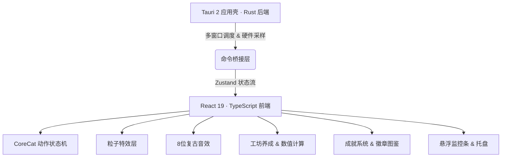

# CoreWorkPal ⚙️🐱

> **把你的 CPU/GPU/RAM 占用率，变成一只猫的冒险故事。**

**CoreWorkPal** 是一款面向开发者与重度 PC 用户的轻量级桌面伴侣，基于 **Tauri 2 + React 19 + TypeScript + Rust** 构建。它实时监控你电脑的硬件状态（CPU、GPU、内存、温度、网络、磁盘），并将这些枯燥的数字转化为一只叫 **CoreCat** 的像素猫咪的动态行为、工坊养成进度以及可收集的成就徽章——让每一天的工作都变得更有趣一点。

---

## 🌟 它能做什么？

### 🐈 CoreCat 桌面宠物 · 硬件驱动的活体表演

CoreCat 是一只透明悬浮在桌面上的像素猫咪，她的行为完全由你的**实时硬件状态**驱动：

| 你的电脑状态 | CoreCat 的反应 |
|:---|:---|
| CPU 高负载 | 疯狂整理文件、汗流浃背地修电脑 |
| 内存快满了 | 抱头蹲在角落、发出警告声 |
| 温度过高 | 拿扇子拼命扇风、喘粗气 |
| 系统闲置 | 懒洋洋打盹、偶尔伸懒腰 |
| 刚刚升级 | 蹦跳庆祝、满屏星光粒子特效 |

- **多层动画系统**：支持骨骼节点驱动的帧动画、CSS 变换、以及独立的粒子特效层（气泡、火花、蒸汽、星光）
- **8 位复古音效**：升级、互动、报警触发时配有机械感的像素音效反馈
- **可互动**：点击"抚摸猫咪"或"整理零件"，CoreCat 会有专属响应动作

---

### 🛠️ 硬件养成工坊 · 让负载变成资源

工坊系统将你每天使用电脑产生的硬件负载转化为可用资源：

- **CPU / GPU / 内存** 占用 → 产生 🔑 **零件**
- **网络吞吐 / 磁盘读写** 活跃度 → 产生 💡 **灵感**

用这些资源可以升级：
- **工坊主等级**（全局产出加成，上限 100 级）
- **6 大硬件工作台子模块**：CPU 核心工作台、GPU 渲染流水线、RAM 零件仓库、NET 数据传输站、TEMP 冷却风扇墙、DISK 数据归档柜

每个模块升级都有独立的效能加成曲线与非线性资源消耗设计，适合长期策略养成。

---

### 🏆 成就系统 · 132 个可收集徽章

CoreWorkPal 内置完整的成就体系，记录你与 CoreCat 共同走过的每一个里程碑：

- **132 个成就**，覆盖 7 大类别：使用习惯、系统监控、工坊升级、工况日志、隐藏彩蛋等
- **5 个难度等级**：入门 → 进阶 → 熟练 → 精英 → 史诗，难度越高徽章越稀有
- **像素徽章图鉴**：每个成就对应一枚独立设计的复古像素风格徽章（.webp 格式），含稀有度框架与主题色系
- **隐藏成就**：部分成就条件刻意不提示，需要自行探索触发
- **进度追踪**：每个成就显示当前达成进度条与具体数值，解锁后奖励成就积分

> 成就积分可在工坊中体现，鼓励持续深度使用。

---

### 📊 系统监控 · 实时、专业、无打扰

- **悬浮监控条**：微型 / 默认 / 展开三档布局，可自由拖动并记忆位置，支持任意组合显示 CPU、内存、磁盘、网络、GPU 等指标
- **任务栏状态集成**：可嵌入系统任务栏辅助区，常驻显示核心数据
- **主控制台仪表盘**：六大硬件模块实时状态卡片 + 历史负载走势图表 + 诊断日志

---

### 📋 工况日报 · 自动生成每日记录

- 每日自动汇总当天的硬件负载曲线、资源产出、异常事件
- 可生成带评级（B / A / S / SS）的工况卡片
- 工况卡片稀有度会触发对应的成就解锁

---

## 📸 界面截图

### 🖥️ 主控制台 — 硬件状态一目了然


---

### 🛠️ 工坊系统

| 工坊主页面 | 子模块升级详情 |
| :---: | :---: |
|  |  |

---

### 🏆 成就图鉴



---

### ⚙️ 工况日报 & 系统设置

| 工况日报 | 系统设置 |
| :---: | :---: |
|  |  |

---

## 🛠️ 技术架构



### 后端 · Rust / Tauri 2

- **毫秒级硬件采样**：低开销多线程循环采集 CPU、GPU、内存、温度、磁盘、网络数据
- **多窗口协同管理**：主控制台、桌面宠物（透明鼠标穿透）、监控挂件、托盘菜单
- **生产环境无黑框**：`windows_subsystem` 配置自动隐藏后台命令行窗口

### 前端 · React / TypeScript / Zustand

- **分模块状态管理**：`settingsStore`、`workshopStore`、`hardwareStore`、`petStore`、`workLogStore`、`achievementStore` 六大 Store，多窗口数据单向同步
- **像素渲染**：所有图标在 SVG 内定义，配合 `image-rendering: pixelated` 保持清晰锐利的像素质感
- **成就引擎**：基于事件驱动的触发器系统，支持复合条件判断与进度持久化

---

## 📂 项目结构

```text
├── .docs/                    # 开发进度追踪与路线图
├── scripts/                  # 辅助工具脚本
│   ├── generate_badges.py    # 成就徽章像素图批量生成脚本
│   ├── optimize-animation-pngs.mjs   # 帧动画无损压缩脚本
│   └── run-corecat-animation-tests.mjs  # 状态机回归测试脚本
├── src-tauri/                # Tauri 2 后端 (Rust)
│   ├── src/
│   │   ├── monitoring/       # 硬件监测实现（CPU/GPU/内存/网络/磁盘/温度）
│   │   ├── commands/         # Tauri 命令层（工坊、成就、日志）
│   │   ├── tray/             # 托盘图标与右键菜单
│   │   ├── lib.rs            # 窗口配置与核心初始化
│   │   └── main.rs           # 程序入口
│   └── tauri.conf.json
└── src/                      # 前端 (React 19 + TypeScript)
    ├── assets/
    │   ├── achievements/     # 132 枚像素风格成就徽章 (.webp)
    │   ├── pets/             # CoreCat 动画帧与头像
    │   └── screenshots/      # README 展示截图
    ├── pages/                # 多页面组件（控制台/工坊/日报/成就/设置/关于）
    ├── pet/                  # CoreCat 状态机、骨骼节点、粒子特效
    ├── services/             # 成就触发器、数值计算、Tauri 桥接
    ├── stores/               # 全局状态（含成就 Store）
    └── ui/                   # 基础组件库与像素图标系统
```

---

## 🚀 快速启动

> 需要本地安装 **Node.js ≥ 18**、**Rust/Cargo**、**pnpm**

```bash
# 1. 安装前端依赖
pnpm install

# 2. 启动开发模式（含热更新）
pnpm tauri dev

# 3. 类型检查
pnpm typecheck

# 4. Rust 单元测试
cd src-tauri && cargo test

# 5. 压缩宠物帧动画资源
pnpm optimize:animations

# 6. 生产构建（打包 .exe 安装包）
pnpm tauri build
```

构建产物：
- **免安装绿色版**：`src-tauri/target/release/core-work-pal.exe`
- **NSIS 安装包**：`src-tauri/target/release/bundle/nsis/CoreWorkPal_x64-setup.exe`

---

## 🛡️ 安全与隐私

- **纯本地运行**：所有数据仅存储于本机，不向任何服务器上传用户数据、进程列表或网络信息
- **开源透明**：完整源代码托管于 GitHub，可自由审计与编译
  → `https://github.com/FiveDayZ/CoreWorkPal`
- **零隐蔽占用**：不含任何后台网络回传、挖矿或敏感资源占用行为

---

*CoreWorkPal v0.2.2 · MIT License · Made with ❤️ and a lot of pixel art*
